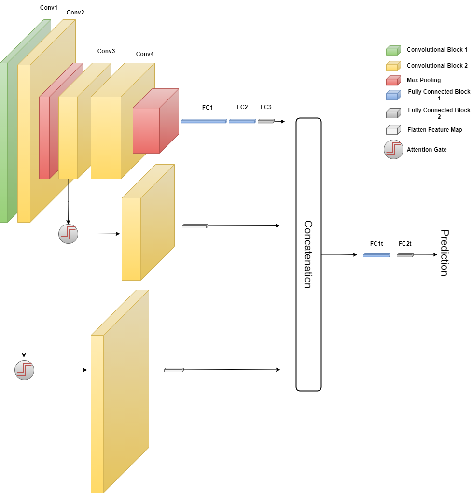

# Machine and deep learning prediction of prostate cancer aggressiveness using multiparametric mri
Official code for [**Machine and deep learning prediction of prostate cancer aggressiveness using multiparametric mri**](https://www.frontiersin.org/journals/oncology/articles/10.3389/fonc.2021.802964/full). This repository contains the code employed to perform all the **deep learning** experiments.



## Dataset
To perform our experiments, we employed a private dataset provided by the Careggi University Hospital (Florence). The aim was to predict prostate cancer aggressiveness for multiparametric MRI images.

## Citation

```bibtex
@article{bertelli2022machine,
  title={Machine and deep learning prediction of prostate cancer aggressiveness using multiparametric mri},
  author={Bertelli, Elena and Mercatelli, Laura and Marzi, Chiara and Pachetti, Eva and Baccini, Michela and Barucci, Andrea and Colantonio, Sara and Gherardini, Luca and Lattavo, Lorenzo and Pascali, Maria Antonietta and others},
  journal={Frontiers in oncology},
  volume={11},
  pages={802964},
  year={2022},
  publisher={Frontiers Media SA}
}
```


